Full Adder 

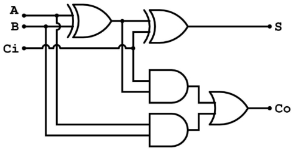

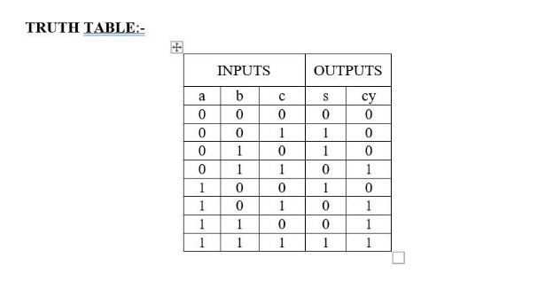

library IEEE; 

use IEEE.STD\_LOGIC\_1164.ALL; entity fa\_016 is 

port(a,b,cin:in std\_logic; s,cout:out std\_logic); 

end fa\_016; 

architecture arch01 of fa\_016 is begin 

s<=a xor b xor cin; 

cout<=(a xor b) and cin; end arch01; 

TEST-BENCH 

library IEEE; 

use IEEE.STD\_LOGIC\_1164.ALL; 

ENTITY fa\_016\_tb IS 

END fa\_016\_tb; 

ARCHITECTURE TESTING OF fa\_016\_tb IS 

COMPONENT fa\_016 IS 

PORT(a,b,cin: IN STD\_LOGIC; 

`      `s,cout:OUT STD\_LOGIC); 

END COMPONENT; 

SIGNAL a,b,cin,s,cout: STD\_LOGIC; 

BEGIN 

DUT:fa\_016 PORT MAP(a=>a,b=>b,cin=>cin,s=>s,cout=>cout); PROCESS 

BEGIN 

a<='0';b<='0';cin<='0'; WAIT for 100ns;  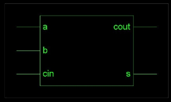a<='0';b<='0';cin<='1'; WAIT for 100ns;  a<='0';b<='1';cin<='0'; WAIT for 100ns;  a<='0';b<='1';cin<='1'; WAIT for 100ns;  

a<='1';b<='0';cin<='0'; WAIT for 100ns;  a<='1';b<='0';cin<='1'; WAIT for 100ns;  a<='1';b<='1';cin<='0'; WAIT for 100ns; a<='1';b<='1';cin<='1'; WAIT for 100ns; END PROCESS ; 

END; 

HALF ADDER 

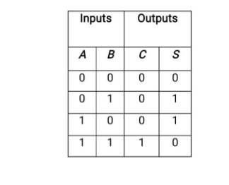

library ieee; 

use ieee.std\_logic\_1164.all; 

entity half\_adder is 

`  `port ( 

`    `ip1 : in  std\_logic; 

`    `ip2 : in  std\_logic; 

`    `sum : out std\_logic; 

`    `ca  : out std\_logic); 

end half\_adder; 

architecture half\_adder\_beh of half\_adder is begin  -- half\_adder\_beh 

`  `sum <= ip1 xor ip2; 

`  `ca <= ip1 and ip2; 

end half\_adder\_beh; 

TEST BENCH 

library ieee; 

use ieee.std\_logic\_1164.all; 

entity half\_adder\_tst is 

end half\_adder\_tst; 

` `architecture beh of half\_adder\_tst is 

`   `component half\_adder 

`       `port ( 

`    `ip1,ip2: in  std\_logic;   -- inputs 

`    `sum,ca: out std\_logic);  -- outputs 

end component; 

`    `signal ip1\_s,ip2\_s : std\_logic;  -- signals 

`    `signal sum\_s,ca\_s : std\_logic;  -- output signals  begin  -- beh 

u1 : half\_adder port map ( 

`  `ip1 => ip1\_s, 

`   `ip2 => ip2\_s, 

`   `sum => sum\_s, 

`  `ca => ca\_s); 

tst\_p: process 

`   `begin 

`      `ip1\_s<='0'; 

`       `ip2\_s<='0'; 

`       `wait for 100 ns; 

`       `ip1\_s<='0'; 

`       `ip2\_s<='1'; 

`       `wait for 100 ns; 

`       `ip1\_s<='1'; 

`       `ip2\_s<='0'; 

`       `wait for 100 ns;        ip1\_s<='1'; 

`       `ip2\_s<='1'; 

`       `wait for 100 ns;     end process; 

` `end beh; 

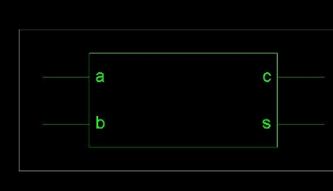

FULL SUBTRACTOR 

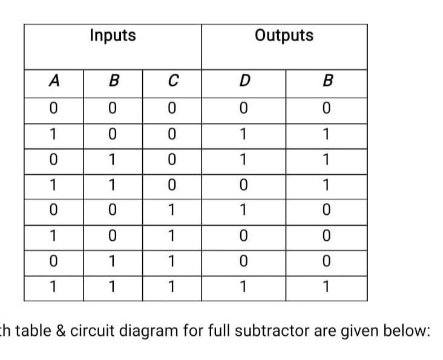

LIBRARY ieee; 

USE ieee.std\_logic\_1164.ALL; 

ENTITY full\_subtractor\_tb IS END full\_subtractor\_tb; 

ARCHITECTURE full\_subtractor\_tb OF full\_subtractor\_tb IS      COMPONENT fullsubtractor 

`    `PORT( 

`         `a : IN  bit; 

`         `b : IN  bit; 

`         `c : IN  bit; 

`         `diff : OUT  bit; 

`         `borrow : OUT  bit         ); 

`    `END COMPONENT; 

signal a : bit := '0'; 

signal b : bit := '0'; signal c : bit := '0'; signal diff : bit; signal borrow : bit; 

BEGIN 

`   `uut: fullsubtractor PORT MAP (           a => a, 

`          `b => b, 

`          `c => c, 

`          `diff => diff, 

`          `borrow => borrow 

`        `); 

` `stim\_proc: process 

` `begin   

` `a <= '0'; 

` `b <= '0'; 

` `c <= '0'; 

` `wait for 50 ns;  a <= '0'; 

` `b <= '0'; 

` `c <= '1'; 

` `wait for 50 ns;  a <= '0'; 

` `b <= '1'; 

` `c <= '0'; 

` `wait for 50 ns;  a <= '0'; 

` `b <= '1'; 

` `c <= '1'; 

` `wait for 50 ns;  a <= '1'; 

` `b <= '0'; 

` `c <= '0'; 

` `wait for 50 ns;  a <= '1'; 

` `b <= '0'; 

` `c <= '1'; 

` `wait for 50 ns;  a <= '1'; 

` `b <= '1'; 

` `c <= '0'; 

` `wait for 50 ns;  a <= '1'; 

` `b <= '1'; 

` `c <= '1';  

` `wait; 

` `end process; END; 

3:8 DECODER 

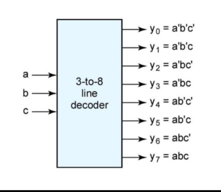

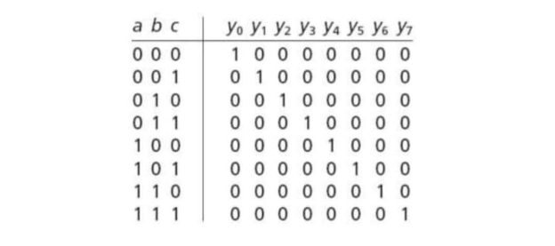

library ieee; 

use ieee.std\_logic\_1164.all; 

entity deco3x8\_seq is   port ( 

ip : in  std\_logic\_vector(2 downto 0);   -- input 

op : out std\_logic\_vector(7 downto 0));  -- output 

end deco3x8\_seq; 

architecture beh of deco3x8\_seq is begin  -- beh 

deco : process (ip) 

`  `variable temp : std\_logic\_vector(7 downto 0);   begin 

`    `case ip is 

`      `when "000" => temp := "00000001"; 

`      `when "001" => temp := "00000010"; 

`      `when "010" => temp := "00000100"; 

`      `when "011" => temp := "00001000"; 

`      `when "100" => temp := "00010000"; 

`      `when "101" => temp := "00100000";       when "110" => temp := "01000000";       when "111" => temp := "10000000";       when others => temp := "XXXXXXXX";     end case; 

`    `op <= temp; 

` `end process deco; 

end beh; 

TEST BENCH 

library ieee; 

use ieee.std\_logic\_1164.all; 

entity deco3x8\_seq\_tst is 

end deco3x8\_seq\_tst; 

` `architecture beh of deco3x8\_seq\_tst is 

`   `component deco3x8\_seq 

`       `port ( 

`    `ip: in  std\_logic\_vector(2 downto 0);   -- inputs 

`    `op: out std\_logic\_vector(7 downto 0));  -- outputs 

end component; 

`    `signal ip\_s : std\_logic\_vector(2 downto 0);  -- signals 

`    `signal op\_s : std\_logic\_vector(7 downto 0);  -- output signals  begin  -- beh 

u1 : deco3x8\_seq port map (   ip => ip\_s, 

`  `op => op\_s); 

tst\_p: process    begin 

`      `ip\_s<="000"; 

`       `wait for 100 ns;        ip\_s<="001"; 

`       `wait for 100 ns;        ip\_s<="010"; 

`       `wait for 100 ns;        ip\_s<="011"; 

`       `wait for 100 ns;        ip\_s<="100"; 

`       `wait for 100 ns;        ip\_s<="101"; 

`       `wait for 100 ns;        ip\_s<="110"; 

`       `wait for 100 ns;        ip\_s<="111"; 

`       `wait for 100 ns;     end process; 

` `end beh; 

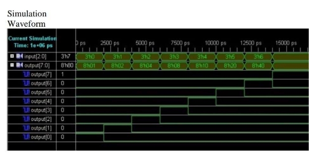

SISO (USING D SYNC RST PE REGISTER) 

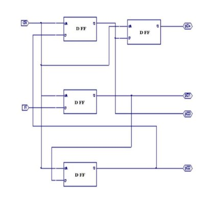

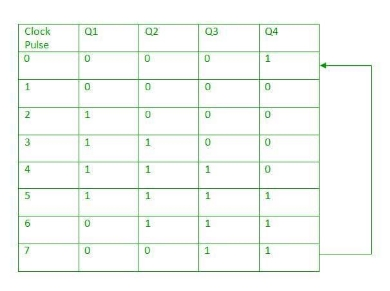

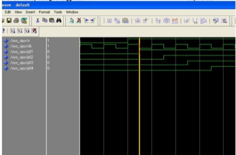

VHDL CODE : 

library IEEE; 

use IEEE.STD\_LOGIC\_1164.ALL; 

entity SISO04PESynRst is port ( 

SI : IN std\_logic; 

rst : IN std\_logic; 

clk : IN std\_logic; 

SO : OUT std\_logic 

); 

end SISO04PESynRst; 

architecture Arch\_SISO04PESynRst of SISO04PESynRst is component Dreg01PESynRst is  

port ( 

d   : IN std\_logic; 

rst : IN std\_logic; 

clk : IN std\_logic; 

q : OUT std\_logic ); 

end component;  

signal s: std\_logic\_vector(3 downto 0); begin 

U0: Dreg01PESynRst port map (SI, rst, clk, s(0)); U1: Dreg01PESynRst port map (s(0), rst, clk, s(1)); U2: Dreg01PESynRst port map (s(1), rst, clk, s(2)); U3: Dreg01PESynRst port map (s(2), rst, clk, s(3)); 

SO <= s(3);  

end Arch\_SISO04PESynRst; 

TEST BENCH FOR SISO: 

library IEEE; 

use IEEE.STD\_LOGIC\_1164.ALL; 

entity SISO04PESynRst\_tb is end SISO04PESynRst\_tb; 

architecture Arch\_SISO04PESynRst\_tb of SISO04PESynRst\_tb is component SISO04PESynRst is 

port ( 

SI  : IN std\_logic; 

rst  : IN std\_logic; 

clk   : IN std\_logic; 

SO   : OUT std\_logic 

); 

end component; 

signal rst, clk  : std\_logic; 

signal SI  : std\_logic; 

signal SO  : std\_logic; 

begin 

DUT: SISO04PESynRst port map (SI, rst, clk, SO); 

process 

begin 

clk <= '0'; wait for 10 ns; 

clk <= '1'; wait for 10 ns; end process; 

process 

begin 

rst <= '1'; wait for 22 ns;  SI <= '0'; wait for 100 ns;  rst <= '0'; wait for 100 ns;  SI <= '1' ;wait for 100 ns;  rst <= '0'; wait for 100 ns;  SI <= '1'; wait for 100 ns;  SI <= '0'; wait for 100 ns;  SI <= '0'; wait for 100 ns;  rst <= '0'; wait for 100 ns;  SI <= '1'; wait for 100 ns;  SI <= '1'; wait for 100 ns;  SI <= '0'; wait for 100 ns;  

end process; 

end Arch\_SISO04PESynRst\_tb; 

SIPO(VHDL AND TEST BENCH): 

**VHDL Code For 4-bit Serial In Parallel Out (SIPO) Shift Register** 

The following is the VHDL code for 4-bit SIPO in behavioural modelling. 

Source: https://www.ee.usyd.edu.au/tutorials/digital\_tutorial/part2/register03.html 

Source Code

library ieee;

use ieee.std\_logic\_1164.all;

entity sipo is

port( res: in std\_logic;

sin: in std\_logic;

clk: in std\_logic;

pout: out std\_logic\_vector(3 downto 0)); end sipo;

architecture beh of sipo is

signal temp: std\_logic\_vector( 3 downto 0); begin

process( clk, res)

begin

if(res='1') then

temp<="0000";

elsif (clk'event and clk ='1') then temp(3)<=sin;

temp(2)<=temp(3);

temp(1)<=temp(2);

temp(0)<=temp(1);

end if;

end process; pout<=temp; end beh;

Testbench 

LIBRARY ieee;

USE ieee.std\_logic\_1164.ALL; ENTITY sr IS

END sr;

ARCHITECTURE behavior OF sr IS

`    `-- Component Declaration for the Unit Under Test (UUT)     COMPONENT sipo

`    `PORT(

`         `res : IN  std\_logic;

`         `sin : IN  std\_logic;

`         `clk : IN  std\_logic;

`         `pout : OUT  std\_logic\_vector(3 downto 0)

`        `);

`    `END COMPONENT;

`   `--Inputs

`   `signal res : std\_logic := '0';

`   `signal sin : std\_logic := '0';

`   `signal clk : std\_logic := '0';

`            `--Outputs

`   `signal pout : std\_logic\_vector(3 downto 0);

-- Clock period definitions

constant clk\_period : time := 50 ns;

BEGIN

`            `-- Instantiate  the Unit Under Test (UUT)    uut: sipo PORT MAP (

`          `res => res,

`          `sin => sin,

`          `clk => clk,

`          `pout => pout

`        `);

`   `-- Clock process definitions

`   `clk\_process :process

`   `begin

`                        `clk <= '0';

`                        `wait for clk\_period/2;                         clk <= '1';

`                        `wait for clk\_period/2;    end process;

||
| :- |
|-- Stimulus process|
|stim\_proc: process|
|begin                       |
|sin<='0';|
|wait for 50 ns;      |
|sin<='0';|
|wait for 50 ns;      |
|sin<='1';|
|wait for 50 ns;      |
|sin<='1';|
|wait for 50 ns;      |
|sin<='0';|
|wait for 50 ns;      |
|sin<='1';|
|wait for 50 ns;      |
|sin<='0';|
|wait for 50 ns;      |
|sin<='1';|
|wait for 50 ns;      |
|sin<='0';|
|wait for 50 ns;      |
|sin<='1';|
|wait for 50 ns;|
|sin<='1';|
|wait for 50 ns;      |
|sin<='0';|
|wait for 50 ns;                              |
|sin<='0';|
|wait for 50 ns;      |
|wait;|
|wait;|
|end process;|
|END;|
||
|Waveform:|
||
||
||
||
PIPO (VHDL AND TEST BENCH): 

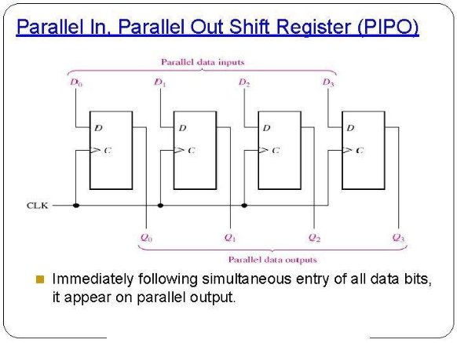

VHDL CODE: 

library ieee;  

use ieee.std\_logic\_1164.all;  

entity pipo is  

port(d: in std\_logic\_vector(3 downto 0);cl,en,clk: in std\_logic;q: out  std\_logic\_vector(3 downto 0));  

end pipo;  

architecture beh of pipo is  

begin  

process(cl,clk)  

begin  

if(cl='1') then  

q<="0000" after 5 ns;  

elsif(clk'event and clk='1') then  

if(en='1') then  

q<= d after 5 ns;  

end if;  

end if;  

end process;  

end beh; 

TEST BENCH FOR PIPO: 

1. **LIBRARY** ieee; 
1. **USE** ieee.std\_logic\_1164.**ALL**; 
 
1. *-- Uncomment the following library declaration if using* 
1. *-- arithmetic functions with Signed or Unsigned values* 
1. *--USE ieee.numeric\_std.ALL;* 
 
1. **ENTITY** REGISTER\_4BIT\_PIPO\_TB **IS** 
1. **END** REGISTER\_4BIT\_PIPO\_TB; 
 
1. **ARCHITECTURE** behavior **OF** REGISTER\_4BIT\_PIPO\_TB **IS**  
 
1. *-- Component Declaration for the Unit Under Test (UUT)* 
 
1. **COMPONENT** REGISTER\_4BIT\_PIPO 
1. **PORT**( 
1. CLK : **IN**  std\_logic; 
1. D : **IN**  std\_logic\_vector(3 **downto** 0); 
1. CE : **IN**  std\_logic; 
20. WE : **IN** std\_logic; 
20. RE : **IN** std\_logic; 
20. CLEAR : **IN**  std\_logic; 
20. PRESET : **IN**  std\_logic; 
20. Q : **OUT**  std\_logic\_vector(3 **downto** 0) 
20. ); 
20. **END** **COMPONENT**; 
 
 
20. *--Inputs* 
20. **signal** CLK : std\_logic := '0'; 
20. **signal** D : std\_logic\_vector(3 **downto** 0) := (**others** => '0'); 
20. **signal** CE : std\_logic := '0'; 
20. **signal** WE : std\_logic := '0'; 
20. **signal** RE : std\_logic := '0'; 
20. **signal** CLEAR : std\_logic := '0'; 
20. **signal** PRESET : std\_logic := '0'; 
 
20. *--Outputs* 
20. **signal** Q : std\_logic\_vector(3 **downto** 0); 
 
20. *-- Clock period definitions* 
20. **constant** CLK\_period : time := 10 ns; 
 
20. **BEGIN** 
 
20. *-- Instantiate the Unit Under Test (UUT)* 
20. uut: REGISTER\_4BIT\_PIPO **PORT** **MAP** ( 
20. CLK => CLK, 
20. D => D, 
20. CE => CE, 
20. WE => WE, 
20. RE => RE, 
20. CLEAR => CLEAR, 
20. PRESET => PRESET, 
20. Q => Q 
20. ); 
 
20. *-- Clock process definitions* 
20. CLK\_process :**process** 
20. **begin** 
20. CLK <= '0'; 
20. **wait** **for** CLK\_period/2; 
20. CLK <= '1'; 
20. **wait** **for** CLK\_period/2; 
20. **end** **process**; 
 
 
20. *-- Stimulus process* 
20. stim\_proc: **process** 
20. **begin**         
 
 
20. CE <= '1', '0' **after** 500 ns; 
 
20. WE <= '0', '1' **after** 100ns; 
20. D <= X"5", X"B" **after** 110ns, X"C" **after** 150ns, X"D" **after** 200ns, X"A" **after** 220ns, X"2" **after** 250ns; 
20. RE <= '0', '1' **after** 190ns; 
 
20. PRESET <= '0', '1' **after** 300ns, '0' **after** 420ns; 
20. CLEAR <= '0', '1' **after** 400ns; 
 
20. **wait**; 
20. **end** **process**; 
 
20. **END**; 

PISO(VHDL CODE AND TEST BENCH): 

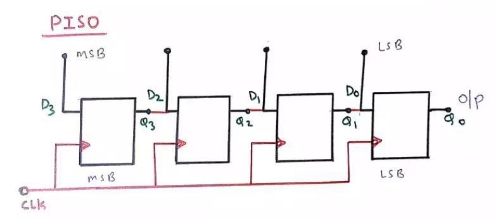

VHDL CODE: 

library ieee; 

use ieee.std\_logic\_1164.all; entity pinsoutshift is 

port (clk, ce, oe, ld : in std\_logic; 

pin : in std\_logic\_vector(7 downto 0); sout : out std\_logic); 

end pinsoutshift; 

architecture pinsoutshift\_a of pinsoutshift is signal inet : std\_logic\_vector(7 downto 0); 

begin 

process(clk,ce,ld) 

begin 

if (ce = '1') then 

if (clk='1') and (clk'event) then if ld = '1' then 

inet <= pin; 

else 

inet(0) <= inet(1); 

inet(1) <= inet(2); 

inet(2) <= inet(3); 

inet(3) <= inet(4); 

inet(4) <= inet(5); 

inet(5) <= inet(6); 

inet(6) <= inet(7); 

inet(7) <= '0'; 

end if; 

end if; end if; 

end process; process(oe) 

begin 

if(ce = '1' and oe = '1') then sout <= inet(0); 

else 

sout <= 'Z'; 

end if; 

end process; 

end pinsoutshift\_a; 

D REGISTER(ASYNC PE RST) 

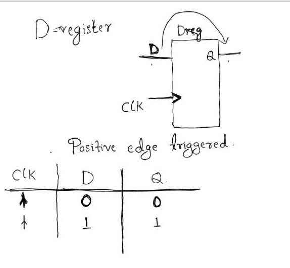

VHDL CODE: 

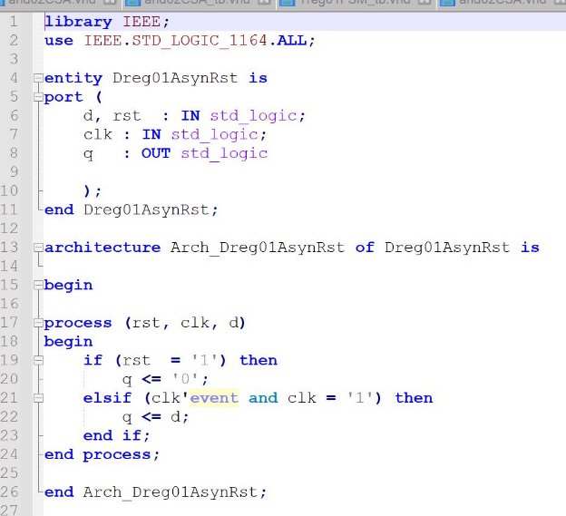

TEST BENCH(D REG ASYC RST): 

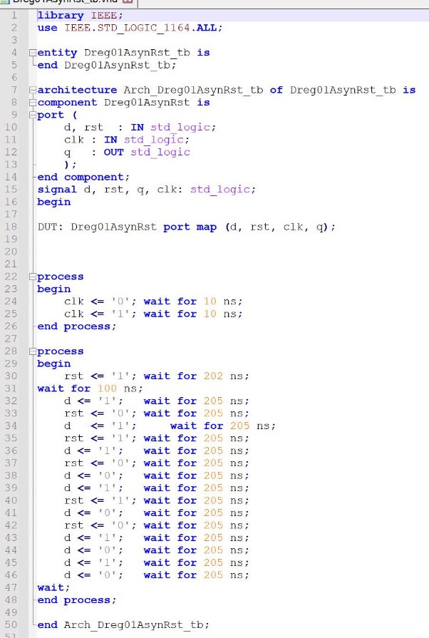

D REGISTER( SYNC RST): 

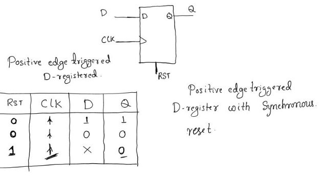

VHDL CODE: 

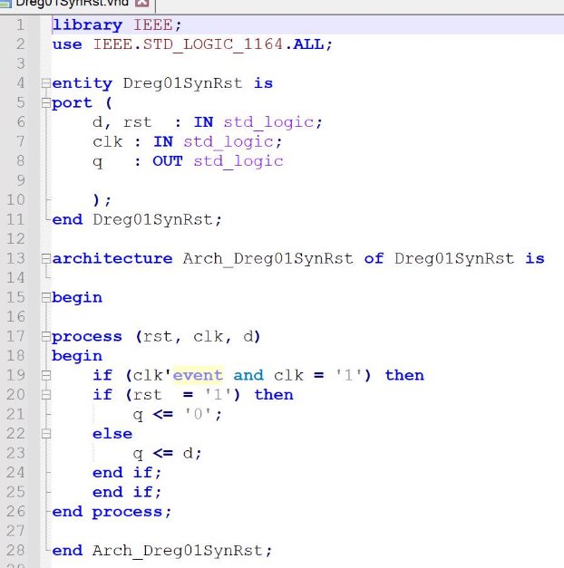

TEST BENCH(D REG SYNC RST): 

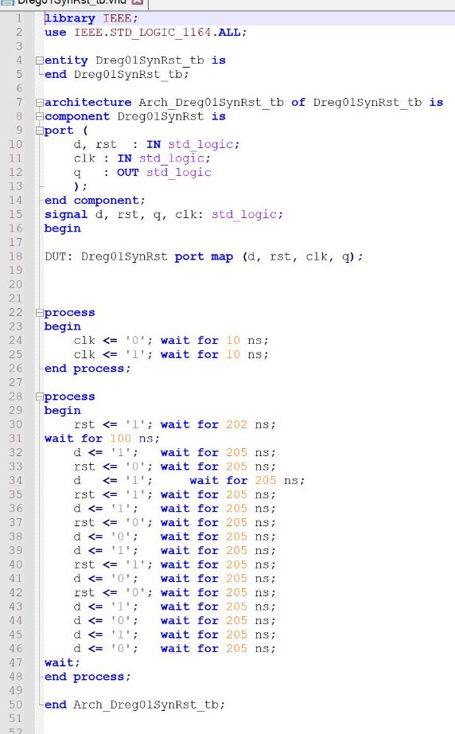

4 BIT Comparator 

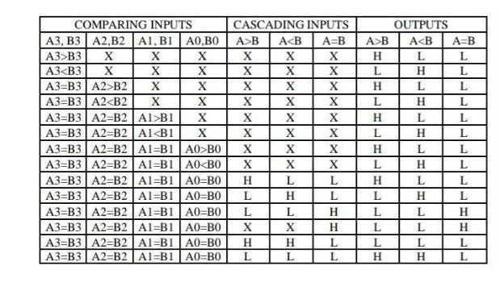

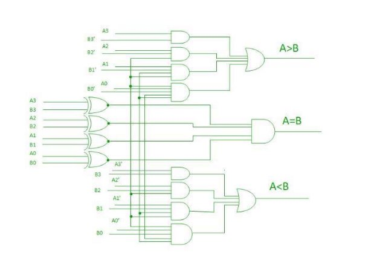

Structural Method 

library ieee; 

use ieee.std\_logic\_1164.all; 

entity mag\_comp\_4b is 

`  `port ( 

`    `a, b : in  std\_logic\_vector(3 downto 0);       -- inputs 

`    `ag, bg, eq : out std\_logic);      -- ag if a > b, bg if b > a, eq if a=b 

end mag\_comp\_4b; 

architecture structural of mag\_comp\_4b is 

signal s : std\_logic\_vector(3 downto 0);         -- intermediate signal begin  

s(0)<= a(0) xnor b(0); s(1)<= a(1) xnor b(1); s(2)<= a(2) xnor b(2); s(3)<= a(3) xnor b(3); 

eq<=s(3) and s(2) and s(1) and s(0); 

ag<=(a(3) and (not b(3))) or 

`    `(s(3) and a(2) and (not b(2))) or 

`    `(s(3) and s(2) and a(1)and (not b(1))) or 

`    `(s(3) and s(2) and s(1) and a(0) and (not b(0))); 

bg<=(b(3) and (not a(3))) or 

`    `(s(3) and b(2) and (not a(2)))or 

`    `(s(3) and s(2) and b(1)and (not a(1))) or 

`    `(s(3) and s(2) and s(1) and b(0) and (not a(0))); 

end structural; 

Behavioral Method 

library ieee; 

use ieee.std\_logic\_1164.all; 

entity mag\_comp\_4b is 

`  `port ( 

`    `a, b       : in  std\_logic\_vector(3 downto 0);       -- inputs 

`    `ag, bg, eq : out std\_logic);                         -- ag if a > b, bg if b > a, eq if a=b 

end mag\_comp\_4b; 

architecture behav of mag\_comp\_4b is 

begin 

` `process (a,b) 

`  `begin 

`   `if (a > b) then 

`    `ag <= '1'; 

`    `bg <= '0'; 

`    `eq <= '0'; 

`   `elsif (b > a) then     ag <= '0'; 

`    `bg <= '1'; 

`    `eq <= '0'; 

`   `else 

`    `ag <= '0'; 

`    `bg <= '0'; 

`    `eq <= '1'; 

`   `end if; 

`  `end process; end behav; 

TEST BENCH 

library ieee; 

use ieee.std\_logic\_1164.all; 

entity mag\_comp\_4b\_tst is 

end mag\_comp\_4b\_tst; 

architecture beh of mag\_comp\_4b\_tst is 

component mag\_comp\_4b 

`  `port ( 

`    `a, b : in  std\_logic\_vector(3 downto 0);                     -- inputs     ag,bg,eq    : out std\_logic);                    -- output 

end component; 

signal a\_s,b\_s : std\_logic\_vector(3 downto 0); 

signal ag\_s,bg\_s,eq\_s : std\_logic; 

begin  -- beh 

`  `u1 : mag\_comp\_4b port map (     a => a\_s, 

`    `b => b\_s, 

`    `ag => ag\_s, 

`    `eq => eq\_s, 

`    `bg => bg\_s); 

`  `tst\_p:process 

`    `begin 

`      `a\_s<="1111"; 

`      `b\_s<="0000"; 

`      `wait for 100 ns;        a\_s<="1010"; 

`      `b\_s<="1100"; 

`      `wait for 100 ns;        a\_s<="1001"; 

`      `b\_s<="0011"; 

`      `wait for 100 ns;        a\_s<="1000"; 

`      `b\_s<="1000"; 

`      `wait for 100 ns; 

`    `end process; end beh; 

JK FLIP-FLOP 

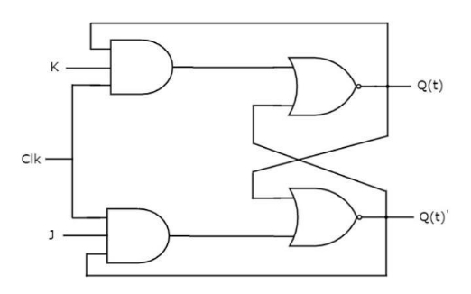

library IEEE; 

use IEEE.STD\_LOGIC\_1164.ALL; 

use IEEE.STD\_LOGIC\_ARITH.ALL; 

use IEEE.STD\_LOGIC\_UNSIGNED.ALL; 

entity JK\_FF is 

port( J, K, clk, rst : in std\_logic; 

Q, Qbar : out std\_logic); 

end JK\_FF; 

architecture behavioral of JK\_FF is begin 

process(clk, rst) 

variable qn : std\_logic; 

begin 

if(rst = '1')then 

qn := '0'; 

elsif(clk'event and clk = '1')then if(J='0' and K='0')then 

qn := qn; 

elsif(J='0' and K='1')then 

qn := '0'; 

elsif(J='1' and K='0')then 

qn := '1'; 

elsif(J='1' and K='1')then 

qn := not qn; else 

null; 

end if; 

else 

null; 

end if; 

Q <= qn; 

Qbar <= not qn; 

end process; end behavioral; 

TEST BENCH 

library ieee; 

use ieee.std\_logic\_1164.all; 

entity JK\_FF\_tb is end JK\_FF\_tb; 

architecture testbench of JK\_FF\_tb is 

component JK\_FF is 

port(J, K, clk, rst : in std\_logic; Q, Qbar : out std\_logic 

); 

end component; 

signal J, K, clk, rst : std\_logic; signal Q, Qbar : std\_logic; 

begin 

uut: JK\_FF port map( J => J, 

K => K, 

clk => clk, 

rst => rst, 

Q => Q, 

Qbar => Qbar); 

clock: process begin 

clk <= '1'; 

wait for 10 ns; clk <= '0'; 

wait for 10 ns; end process; 

Force: process begin 

J <= '0'; 

K <= '0'; 

rst <= '0'; 

wait for 20 ns; 

J <= '0'; 

K <= '1'; 

rst <= '0'; 

wait for 20 ns; 

J <= '1'; 

K <= '0'; 

rst <= '0'; 

wait for 20 ns; 

J <= '1'; 

K <= '1'; 

rst <= '0'; 

wait for 20 ns; 

J <= '1'; 

K <= '1'; 

rst <= '0'; 

wait for 20 ns; 

J <= '0'; 

K <= '0'; 

rst <= '0'; 

wait for 20 ns; 

J <= '0'; 

K <= '0'; 

rst <= '1'; 

wait for 20 ns; end process; end testbench; 

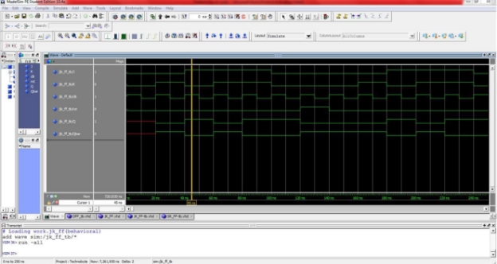

T REGISTER(VHDL  AND TEST BENCH): 

VHDL CODE: 

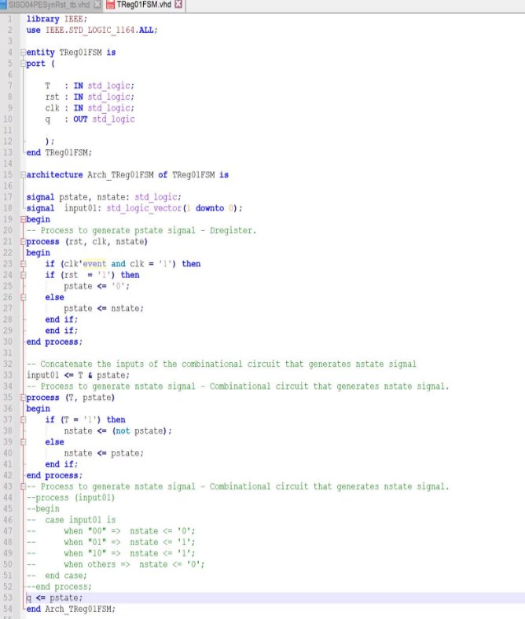

TEST BENCH: 

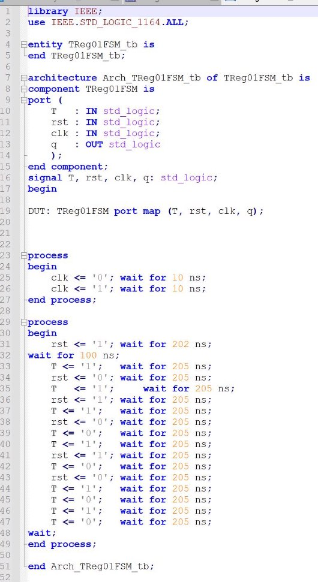
